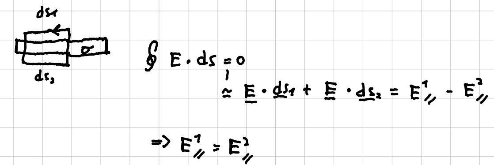
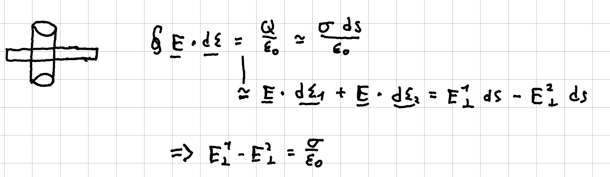

La [[Legge di Gauss]] e la conservatività ci permettono di studiare il comportamento del [[Lavoro, energia e campo elettrico|campo elettrico]] nel passaggio attraverso ad una superficie carica.

## Componente parallela
La conservatività del campo elettrico (o della forza di Coulomb) può essere scritta come:
$$ \oint \vec{E}\cdot\vec{ds}=0 $$
Consideriamo ora un percorso rettangolare, con i lati lunghi paralleli alla superficie e molto vicini ad essa. In questo modo i lati corti non contribuiscono all'integrale, mentre sui lati lunghi la componente che contribuisce è solo quella parallela. I segni dei contributi sono diversi perché i due lati sono percorsi con verso opposto.

La componente di E parallela alla superficie è quindi continua.

## Componente normale
Consideriamo ora un prisma generico con le facce parallele alla superficie e altezza piccola. Le facce laterali non contribuiranno in modo significativo al flusso, come nel caso di prima. Questa volta a contribuire al flusso sarà solo la componente di E normale alla superficie.

La componente normale di E è discontinua e la discontinuità è proporzionale alla densità di carica sulla superficie.

#Elettrostatica 