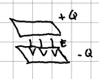
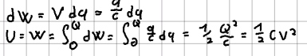
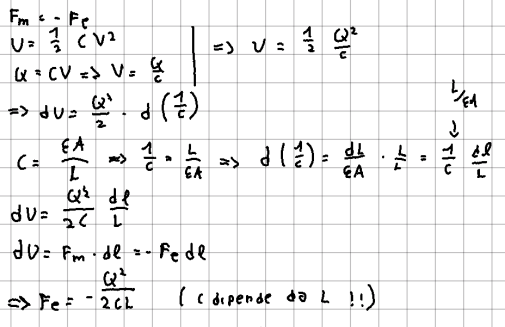
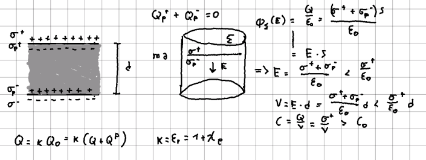

## Capacità
Introduciamo una grandezza nota come capacità, definita come: $$ C = \frac{Q}{V} $$
L'importanza di questa grandezza sta nel fatto che la relazione tra potenziale e [[Cariche e struttura elettrica della materia|carica]] accumulata da un conduttore è solitamente lineare. La capacità è una misura di quanta carica un conduttore è in grado di accumulare per unità di potenziale.

Si può mostrare che per qualsiasi sistema contenente conduttori a potenziale fissato, esiste una matrice i cui coefficienti (detti coefficienti di capacità) permettono di calcolare la carica accumulata sui singoli conduttori. Questa matrice è inoltre simmetrica e invertibile, permette quindi di calcolare i potenziali, nota la carica sulle superfici.

La capacità e i coefficienti di capacità dipendono solamente dalla geometria del problema. Nel caso dei coefficienti di capacità, questi possono essere ricavati uno per volta, annullando tutti i potenziali tranne due e ripetendo il processo.

## Condensatori
Abbiamo detto che un conduttore può accumulare carica quando posto a un certo potenziale. Questa proprietà può essere sfruttata per creare degli oggetti in grado di accumulare energia sotto forma di campo elettrico. Questi oggetti sono i condensatori e solitamente hanno capacità nota o facilmente calcolabile.

I condensatori piani sono formati da due facce (armature) parallele:

e la loro capacità vale: $$ C=\frac{\epsilon A}{L} $$
Il calcolo dell'energia immagazzinata nel campo elettrico di un condensatore può essere svolto integrando la [[Energia del campo elettrostatico|| densità di energia]] sul volume, oppure più semplicemente calcolando l'energia necessaria ad accumulare la carica sulle sue armature:

Sulle armature è accumulata una carica e tra le due vi è un campo elettrico, quindi agisce sicuramente una forza. Proviamo ora a calcolare questa forza per un condensatore piano, partendo dall'energia potenziale accumulata nel campo, uguagliandone il differenziale al lavoro di una forza esterna per separare le armature e infine ottenendone la forza elettrica:

### Condensatori con dielettrici
Se riempiamo di [[Dielettrici|dielettrico]] lo spazio tra le armature di un condensatore, il campo elettrico provocherà una polarizzazione e quindi una carica di polarizzazione. Prendiamo come esempio un condensatore piano riempito di dielettrico lineare isotropo:

La capacità del condensatore è quindi aumentata, perché la carica sulla superficie del dielettrico riduce l'intensità del campo elettrico e di conseguenza (a parità di carica) la differenza di potenziale tra le armature è minore. Sia $C$ la capacità del condensatore vuoto e $C'$ quella dopo averlo riempito di dielettrico, introduciamo la costante dielettrica $\epsilon_r=\kappa$, per cui valgono le relazioni:
$$ C'=\epsilon_{r}C\qquad \epsilon_{r>1\qquad}\epsilon_r=\upchi_e+1 $$
Notare che la differenza di potenziale determina ancora l'intensità del campo, indipendentemente dalla presenza o meno del dielettrico. La differenza sta nella quantità di carica che è necessario accumulare per ottenerla.

#Elettrostatica