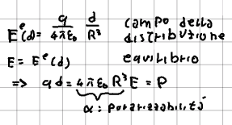
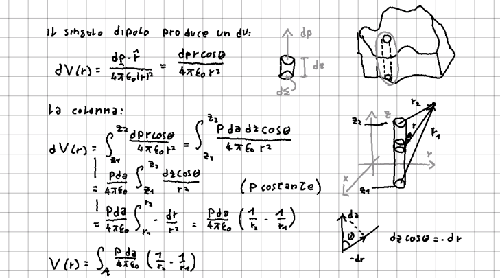
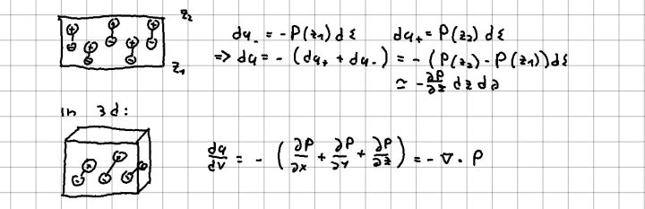
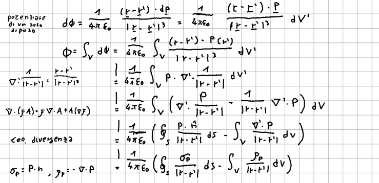
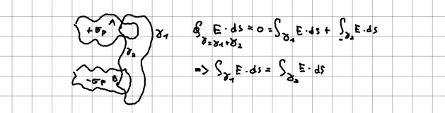

La materia è generalmente [[Cariche e struttura elettrica della materia|elettricamente neutra]], nonostante ciò alcune sostanze possono produrre campi elettrici o interagire con essi. Abbiamo già visto il comportamento dei conduttori, in questa sezione studieremo le proprietà dei dielettrici o isolanti ideali.

## Dipoli atomici
L'atomo d'idrogeno (il più semplice), può essere modellato come un nucleo carico positivamente, circondato da una distribuzione sferica di carica negativa. Quando l'atomo è immerso in un campo elettrico, il nucleo positivo si sposta fino a raggiungere un punto dove il campo generato dalla distribuzione sferica bilancia quello esterno:

Per molecole più complicate, il processo è simile.

Un calcolo esatto richiederebbe la meccanica quantistica, ma queste grandezze sono facilmente misurabili in laboratorio.

Alcune molecole hanno un [[Dipoli elettrici|momento di dipolo]] permanente, dovuto alla distribuzione delle cariche che le compongono. Un esempio di molecola polare è l'acqua.

I momenti di dipolo permanenti solitamente sono molto grandi.

## Campo elettrico della materia polarizzata
Introduciamo una grandezza $\vec{P}$ chiamata densità di polarizzazione (o semplicemente polarizzazione) tale che:
$$ \vec{dp} = \vec{P}dV $$
### Polarizzazione costante e carica superficiale
Consideriamo un volume di dielettrico con $\vec{P}$ costante in direzione $\vec{z}$ e calcoliamo il potenziale che produce:

Notiamo che il potenziale è lo stesso generato da due strati di carica uniforme $\sigma = |\vec{P}|$.

Questo risultato si può generalizzare: sulla superficie di un volume di dielettrico con polarizzazione $\vec{P}$ è presente una densità di carica (netta/equivalente) pari a:
$$ \sigma = \vec{P}\cdot\vec{n} $$
dove $\vec{n}$ è la normale alla superficie.

### Polarizzazione non costante e carica di volume
Se la polarizzazione non è costante nel volume, allora le cariche dei dipoli non si annulleranno completamente e ci sarà un effetto equivalente a una distribuzione volumetrica di carica:

(nota che il cambio di segno è dovuto al fatto che stiamo studiando una carica di volume, quindi in mezzo alle due superfici. I dipoli sono formati da due cariche di segno opposto, quindi se un dipolo ha una carica positiva sulla faccia sopra/sotto avrà carica negativa in mezzo. Questo ragionamento si può generalizzare a distribuzioni non orientate lungo un asse, ripetendolo per ognuna delle 3 direzioni)
### Dimostrazione formale
I risultati precedenti possono essere mostrati formalmente calcolando esplicitamente il potenziale generato da un volume di dielettrico con polarizzazione generica e sfruttando il [[Divergenza e legge di Gauss in forma differenziale|teorema della divergenza]] e alcune identità vettoriali per manipolare gli integrali ottenuti.

Il potenziale ottenuto è quindi lo stesso generato da due distribuzioni di carica:
- $\sigma_p=\vec{p}\cdot\vec{n}$ (sulle superfici)
- $\rho_p=-\nabla\cdot\vec{P}$ (nel volume)
Lo stesso vale per il campo.
## Campi all'interno del dielettrico
Consideriamo nuovamente un dielettrico con polarizzazione costante per semplicità. I campi all'interno del dielettrico saranno molto complicati: molto forti vicino ai dipoli atomici e deboli lontano. Sono comunque campi elettrostatici [[Lavoro, energia e campo elettrico|per cui vale]]:
$$ \oint\vec{E}\cdot\vec{ds}=0 $$
da cui:

Il campo all'interno non è lo stesso generato da due distribuzioni di carica uniformi, ma il suo integrale sì.

Se sostituiamo le usuali grandezze elettriche con delle medie fatte su volumi grandi rispetto ai dipoli atomici, ma piccoli rispetto all'oggetto, possiamo preservare le leggi dell'elettrostatica che conosciamo e considerare il dielettrico equivalente alle distribuzioni di cariche di polarizzazione nel vuoto.

## Tipi di dielettrici
In generale la polarizzazione è una funzione di $\vec{E}$ che può anche essere molto complicata. Esistono alcuni dielettrici in cui questa relazione è più semplice:
- dielettrici lineari: la relazione è di tipo lineare: $$ P^{i}=\epsilon_0\upchi_{ij}E^j $$
- dielettrici isotropo: $\vec{P}$ e $\vec{E}$ sono paralleli
- dielettrici lineari isotropi: sono il caso più semplice $$ \vec{P}=\epsilon_0\upchi\vec{E} $$
Il campo che determina la polarizzazione è il campo totale (quindi include anche quello prodotto dalla materia polarizzata stessa).

#Elettrostatica