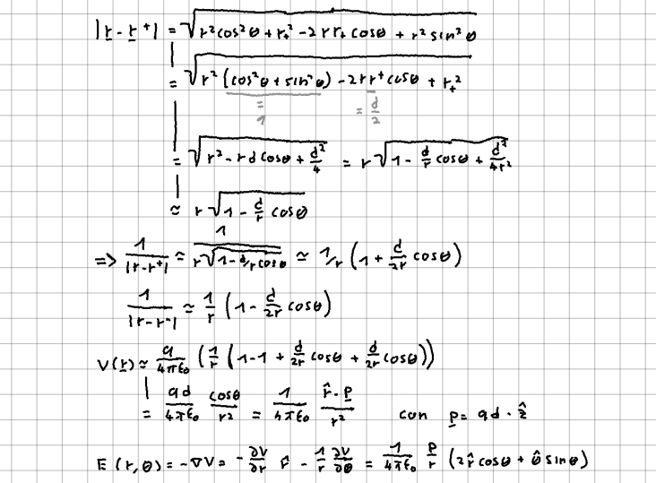

Studiamo ora un sistema formato da due [[Cariche e struttura elettrica della materia|cariche]] uguali in modulo, ma con segno opposto. Questo tipo di sistema risulterà molto importante nello studio dei dielettrici.

## Potenziale di un dipolo
Il potenziale generato da un dipolo è facilmente calcolabile con il principio di sovrapposizione: $$ V(\vec{r})=\frac{q}{4\pi\epsilon_{0}} \left(\frac{1}{|\vec{r}-\vec{r^{+}|}} - \frac{1}{|\vec{r}-\vec{r^{-}|}}\right)$$ dove $\vec{r}^{\pm}$ sono le posizioni delle cariche positive e negative. Questa formula esatta può essere approssimata per distanze grandi ($|\vec{r}|>>|\vec{r}^+-\vec{r}^-|=d$), ottenendo un'equazione più semplice.

Possiamo quindi introdurre il momento di dipolo: $$\vec{p} = q\vec{d}$$
e ottenere delle equazioni molto sintetiche per potenziale e campo.

## Dipolo in un campo uniforme
Consideriamo ora un dipolo immerso in un campo elettrico uniforme.

La somma delle forze agenti sulle due cariche è nulla: $$ |\vec{F}^{+}| = qE = |\vec{F}^-| $$
ma il momento meccanico non necessariamente: $$ |\vec{\tau}| = | \vec{F}\times\vec{d} |=qEd\sin\theta = pE\sin\theta $$
Passando ora al lavoro:

## Dipolo in un campo non uniforme
Se il campo elettrico non è uniforme, allora la forza totale non sarà nulla, ma sarà legata alla differenza nel valore di $\vec{E}$ nei punti occupati dalle due cariche. Nell'approssimazione di dipolo, la distanza tra le due cariche è pero considerata piccola e questa differenza diventerà quindi una derivata:

#Elettrostatica