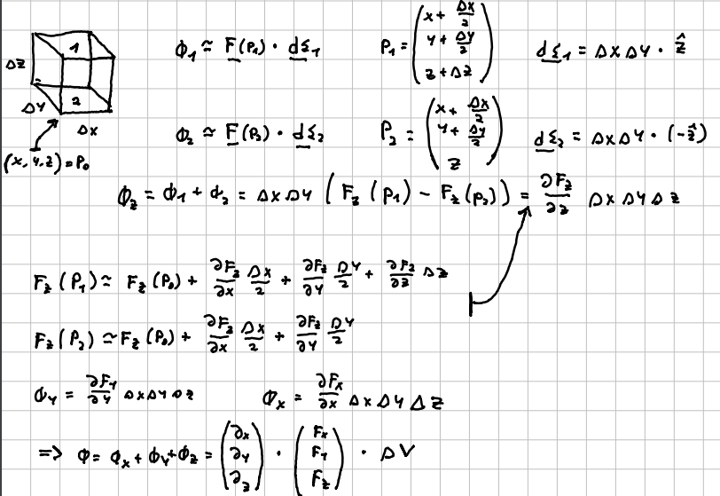
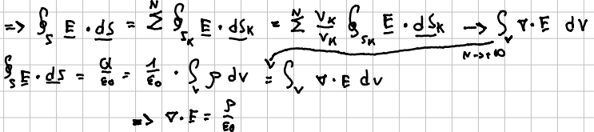

La [[Legge di Gauss]] è espressa in termini di grandezze integrali ($\Phi_\Sigma(E)=\oint Eds$;  $Q=\int_\tau\rho$). Volendola riscrivere in termini differenziali, si incontra subito un problema: $$ \Phi_\Sigma(\vec{E})=\oint_\sigma\vec{E}\cdot\vec{d\Sigma}\sim\vec{E}\cdot\vec{\Sigma}\rightarrow0 \qquad \text{per } \Sigma\rightarrow0 $$
Non è quindi sufficiente considerare superfici infinitesime, ma occorre introdurre un'altra grandezza.

## Divergenza
Definiamo la divergenza come limite di flusso per unità di volume:
$$ div\cdot\vec{A} = \nabla\cdot\vec{A} = \lim_{\tau\rightarrow0}\frac{\Phi}{\tau} $$
Questa definizione non è molto pratica da usare nei conti, ma possiamo trovarne una più comoda calcolando il flusso di un generico campo vettoriale $\vec{F}$ su un cubo infinitesimo di lati $\Delta x,\Delta y, \Delta z$ .
Posto $P_0=(x,y,z)$ uno degli spigoli del cubo, possiamo procedere al calcolo del flusso dividendolo in 3 termini:
$$ \Phi = \Phi_x+\Phi_y+\Phi_z $$
che rappresentano i contributi sulle coppie di facce parallele.
Sfruttando le dimensioni infinitesime del solido, potremo poi approssimare al primo ordine gli incrementi di $\vec{F}$ e arrivare al risultato:
$$ div\cdot\vec{F} = \nabla\cdot\vec{F} $$

## Legge di Gauss per E
Rimane ora il problema di riformulare la legge di Gauss in termini differenziali usando l'operatore appena definito. Guardando il suo enunciato in forma integrale, sarebbe sufficiente applicare il teorema di Gauss per campi vettoriali generici e uguagliare gli integrandi.

In alternativa possiamo suddividere  il calcolo del flusso attraverso una superficie nel calcolo attraverso N superfici più piccole, passare al limite $N\rightarrow+\infty$ e introdurre la definizione di divergenza:

#Elettrostatica