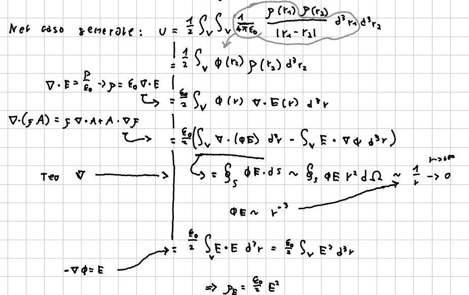

Il [[Lavoro, energia e campo elettrico|campo elettrostatico]] è una forza per unità di carica e può quindi compiere un lavoro. E' quindi naturale pensare che contenga una densità di energia (energia per unità di volume) che quantifichi questa possibilità di compiere lavoro. Di seguito calcoleremo questa densità, studiando prima il caso di una sfera carica, poi un caso più generale.

## Sfera carica
Un modo semplice per quantificare la densità di energia elettrostatica è quello di studiare un sistema formato da una sfera conduttrice dotata di carica, calcolare la pressione che viene esercitata sulla sua superficie e infine il lavoro che occorre per comprimerla. Questo lavoro sarà uguale a una variazione di energia, che riusciremo a riportare a una densità di energia.

Iniziamo identificando una sezione infinitesima $d\vec{A}$ della superficie della sfera e calcolando la forza che agisce su di essa. La forza sarà data da $$d\vec{F}=\vec{E} dq$$
e il campo elettrico: $$ \vec{E}_{tot} = \vec{E}_s + \vec{E}_{dA} $$
dove $\vec{E}_s$ è il campo prodotto dalla sfera e $\vec{E}_{da}$ quello prodotto dal differenziale di superficie. Possiamo omettere il simbolo di vettore e sottintendere che stiamo lavorando in direzione radiale rispetto al centro della sfera, grazie alle simmetrie del problema.

Applicando la [[Legge di Gauss]] a un cilindro infinitesimo con facce parallele alla superficie, possiamo calcolare facilmente il campo generato da $dA$: $$ E_{dA} = \frac{\sigma}{2\epsilon_0} $$ Possiamo applicare un procedimento analogo al campo totale (consideriamo una sfera stavolta): $$ E_{tot}=\frac{\sigma}{\epsilon_0} $$
E quindi il campo della sfera vale: $$ E_s=E_{tot} - E_{dA}=\frac{\sigma}{2\epsilon_0} $$
La forza totale dovuta al campo generato da $dA$ sarà nullo per ragioni di simmetria. La forza che agisce varrà quindi: $$ dF = Edq=E_s\sigma dA $$
da cui:
$$ \frac{dF}{dA} = P =\sigma E_s = \frac{\sigma^2}{2\epsilon_0} = \frac{\epsilon_0}{2}E^2_{tot} $$
dove $P$ è la pressione elettrostatica.

Provando ora a comprimere la sfera, cambiandone il raggio di $dr$, si compie lavoro contro la pressione elettrostatica:
$$ dW = PSdr = \frac{2\sigma^2\pi r^2}{\epsilon_0}dr = \frac{\sigma^2}{2\epsilon_0}dV = \frac{\epsilon_0}{2}E^2_{tot} dV  $$
dove $dV$ è il differenziale di volume associato a $dr$. Abbiamo inoltre considerato $\sigma$ costante.

La densità di energia vale quindi: $$ u_e = \frac{dU}{dV} = \frac{dW}{dV} = \frac{\epsilon_0}{2}E^2 $$
## Caso generale
Mostriamo ora che l'equazione ottenuta ha validità generale. Per farlo studieremo l'energia potenziale di una distribuzione generica di cariche e sfruttando alcune delle leggi dell'elettrostatica manipoleremo l'integrale fino a giungere al risultato. Per questo conto sono particolarmente importanti la [[Divergenza e legge di Gauss in forma differenziale|legge di Gauss in forma differenziale]], la [[Lavoro, energia e campo elettrico|relazione tra campo e potenziale]] e alcune identità vettoriali. L'energia potenziale è calcolata generalizzando la formula per l'energia potenziale di un sistema di cariche a distribuzioni di carica arbitrarie (la somma diventa un integrale).

#Elettrostatica