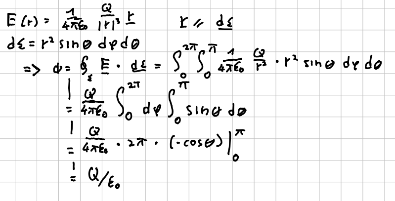
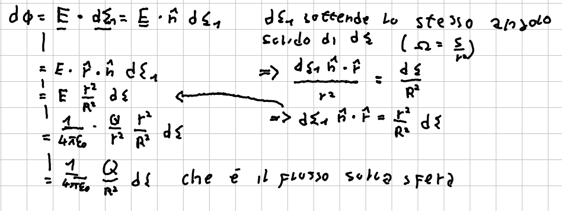

La legge di Gauss per il  campo elettrostatico dice:
$$ \oint_\Sigma\vec{E}\cdot\vec{d\Sigma}=\frac{Q}{\epsilon_0} $$
dove $Q$ indica la carica totale all'interno della superficie $\Sigma$ e $\vec{d\Sigma}=d\Sigma\cdot\vec{n}$ è il differenziale di superficie. Solo la carica contenuta all'interno della superficie contribuisce al flusso.

Una conseguenza interessante del teorema è che non esistono equilibri stabili in un campo elettrostatico (dove non ci sono cariche).

## Dimostrazione
La dimostrazione può essere divisa in quattro parti:
1. Consideriamo come $\Sigma$ una sfera centrata su una carica
2. Generalizziamo il risultato a una generica superficie $\Sigma$
3. Sfruttiamo la linearità dell'elettrostatica per generalizzare a più cariche in superfici generiche
4. Mostriamo che le cariche esterne non contribuiscono al flusso

## Step 1

dove abbiamo sfruttato la caratteristica della sfera per cui i raggi sono sempre normali alla superficie, poi svolto esplicitamente il calcolo del flusso partendo dall'equazione per l'elemento di superficie $d\Sigma$.

## Step 2
Confrontiamo ora il contributo al flusso su una superficie generica con quello calcolato allo step precedente per la sfera. Mostriamo che questo dipenderà sostanzialmente dall'angolo solido sotteso e il flusso risulterà quindi lo stesso.

## Step 3
La linearità delle leggi dell'elettrostatica permette di estendere facilmente questo risultato al caso di più cariche o distribuzioni di carica.

## Step 4
Considero l'unione di due superfici. Introduco una strozzatura tra le due (rimpicciolisco la loro intersezione) e la rendo sempre più piccola. Il flusso sull'unione non dipende dalla forma e varrà quindi:
$$ \Phi_{\Sigma_1+\Sigma_2} = \frac{q}{\epsilon_0} $$
Rendendo la strozzatura infinitesima, solo una delle due conterrà la carica:
$$ \Phi_{\Sigma_1}=\frac{q}{\epsilon_0} $$
ma per la linearità:
$$\Phi_{\Sigma_1+\Sigma_2} = \frac{q}{\epsilon_0} = \Phi_{\Sigma_1} + \Phi_{\Sigma_2}$$
quindi:
$$ \Phi_{\Sigma_2} = \Phi_{\Sigma_1+\Sigma_2} - \Phi_{\Sigma_1} = 0 $$

#Elettrostatica