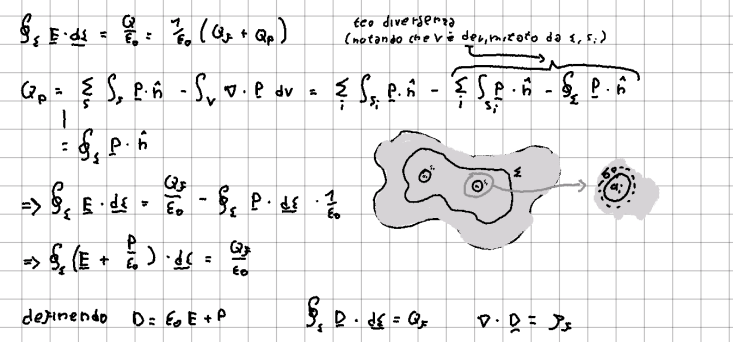
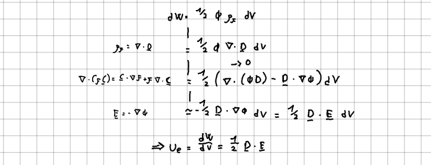

## Legge di Gauss
Consideriamo delle cariche immerse in un dielettrico. Queste cariche genereranno un campo elettrico che a sua volta [[Dielettrici|genererà delle cariche di polarizzazione]] (di superficie e di volume). 

La [[Legge di Gauss]] "standard" è ancora valida se si considerano le cariche di polarizzazione, ma questo può risultare scomodo. Possiamo però definire un nuovo campo $\vec{D}$ (campo di induzione elettrica o spostamento elettrico) e riformulare la legge in modo da considerare solo le cariche libere. 

Per farlo sfrutteremo il teorema della divergenza per ottenere un'equazione più semplice per le cariche di polarizzazione, che tenga conto sia di quelle di volume che di quelle di superficie:

Abbiamo quindi introdotto il campo: $$ \vec{D} = \epsilon_0\vec{E}+\vec{P}=\epsilon_0\vec{E}+(\epsilon_r-1)\vec{E}=\epsilon\vec{E} $$
## (Dis)continuità
Nel vuoto ($\vec{D}=\epsilon_0\vec{E}$) o all'interno di un dielettrico il comportamento di $\vec{D}$ è lo stesso di $\vec{E}$, ma rimane da studiare il suo comportamento al passaggio tra dielettrici diversi.

Applichiamo la legge di gauss a un cilindro con facce parallele a un'interfaccia tra dielettrici differenti (come avevamo fatto per studiare le [[(Dis)continuità di E|discontinuità di E]]). Notiamo che non vi è carica libera, quindi:
$$ \vec{D}_\perp^{1}-\vec{D}_\perp^2=0 $$
Ma per il campo elettrico: $$\epsilon_{1}\vec{E}^1_\perp=\epsilon_2\vec{E}^2_\perp $$
Per le componenti parallele all'interfaccia, calcoliamo la circutazione e sfruttiamo la conservatività di $\vec{E}$, ottenendo: $$ \vec{D}^1_\parallel=\vec{D}^{2}_{\parallel} $$ $$ \vec{E}^1_\parallel=\vec{E}^{2}_{\parallel} $$
## Densità di energia
Possiamo calcolare la densità di energia associata a un campo $\vec{D}$, [[Energia del campo elettrostatico|come avevamo fatto per E]]: studiando il differenziale di lavoro necessario a portare una (densità di) carica a un certo potenziale.

Questa formula è valida per dielettrici lineari e include il lavoro necessario a polarizzare il dielettrico.

#Elettrostatica